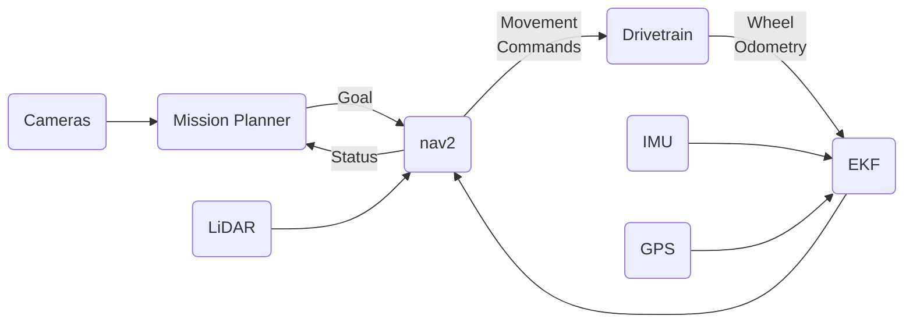

# Autonomy

The autonomy subsystem is an extremely important part of our rover.

# Autonomy

Autonomy is responsible for making the rover complete a mission without direct operator control.

For the autonomy mission, you are given three different types of targets, and the rover must navigate to them then possibly perform some action, entirely
without any user input.

We are primarily using [nav2](https://docs.nav2.org/) due to its ease of use and the number of available tutorials & guides for it. nav2 helps with the
navigation aspect of autonomy, and then we have an autonomy mission planner which coordinates everything.

## Overview

The autonomy system sort of very roughly works like this:

