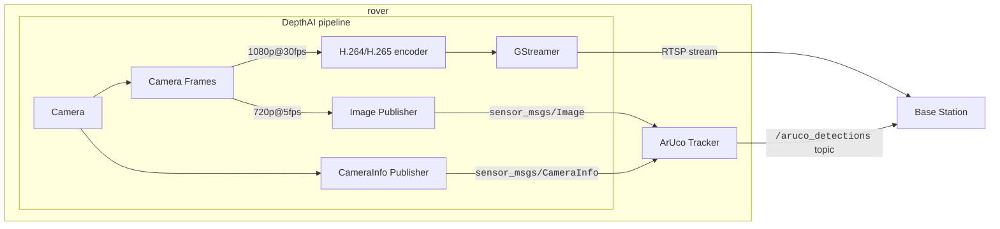

# ArUco image bridge

Publishes a low-rate raw image and matching `CameraInfo` from the Luxonis cameras so the ArUco tracker (`ros_aruco_opencv`) can detect markers. Enable it with `main.py --ros`; the options and topics are in [`luxonis_scripts/README.md`](../README.md).



## Status

Verified without hardware: unit tests and a synthetic end-to-end run (below). Not yet validated on the rover: real DepthAI frames and calibration, the per-output frame rate on the camera, and Jetson performance. Remove this section once tested.

## Synthetic test (no camera)

With ROS, the workspace and the camera virtualenv active, one command per terminal:

```bash
# from luxonis_scripts/: a fake camera publishing marker 7
python3 -m aruco_image_bridge.publish_test_images --dictionary 4X4_50
# from the repository root: the tracker on the fake topic
ros2 launch rover-bringup/launch/aruco_tracker.py cam_base_topic:=/test/camera/front/image_raw
# from luxonis_scripts/: check the stream, then the detections
python3 -m aruco_image_bridge.check_test_stream --dictionary 4X4_50
ros2 topic echo /aruco_detections --once
```

Expect `PASS` from the checker and `id: 7` at `pose.position.z` ≈ 0.603 (800 × 0.15 / 199 px). `--encoding mono8` on both tools tests grayscale. The tracker's dictionary cannot change while it runs, so restart both to try another one; a 5X5 marker shown to a `4X4_50` tracker must give `markers: []`.
